# PowerHub Billing & Automation System
### End-to-end payment, grace management, and lifecycle communications. SunKing Pay Kenya.

---

## Overview

PowerHub is a solar energy lease-to-own product sold to Kenyan households. Customers make fixed monthly payments over a multi-year period until they fully own the inverter system. Unlike pay-as-you-go models, the device only reactivates when cumulative payments cover all outstanding months. A partial payment against arrears does not restore access. Pay up to date and the system comes back on automatically within the hour.

I designed and built the full data system that makes this work: from the moment a payment hits the source table to the moment the customer's device receives an instruction, a bill lands in their email, or an SMS reaches their phone.

This is a case study of that system.

---

## The Problem

When the pilot was being designed, there was no automated way to:
- Know when a customer's payment covered their billing period
- Tell the device to stay on or turn off based on payment status
- Warn customers before their light went off
- Send invoices on a predictable schedule
- Track customers who had been 60 or 90 days overdue for escalation and recovery

Everything was manual. At scale, this was not viable.

---

## Business Rules (the hard part)

Before writing a single line of SQL, I had to model the business logic precisely. This is where most of the complexity lives.

**Free days:** Every customer gets 30 days of free light from registration. No payment is required during this window.

**Prorated first month:** The first billable month is prorated based on how many days remain after the free period ends. A customer who registers on the 23rd of a month has only 8 billable days in that month, not 31.

**Payment coverage:** Payments are cumulative. A payment of KES 8,000 on a KES 4,350/month product covers the prorated first month plus one full month. Any remainder is parked as credit toward the next month.

**Grace windows:**
- *Payment grace:* 1st to 5th of the billing month. Customer gets 5 days of light even if they have not paid yet.
- *Monthly grace:* 6th to end of month. Triggered on the 5th if customer still has not paid. Only applies if outstanding dues = 1.
- *Rolled days:* For customers whose free period ends 1 to 6 days before month end. A short grace extension to avoid a tiny gap in coverage.

**Bad actor threshold:** If a customer has 2 or more months of outstanding dues, they are excluded from grace windows entirely. At 2 months overdue, a final-notice SMS goes out. At 3 months, a recovery notice fires.

---

## System Architecture

**Stack:** Amazon Redshift · LookML / Looker · REST API

---

## The Four Engines

### 1. Payment Trigger (hourly)

Reads every payment made in the past hour. For each payment, calculates:
- How many months the cumulative total now covers
- What date the light should turn on from
- What date it should turn off

Outputs one row per payment with `light_start_date`, `light_end_date`, and `days_of_light`. The automation team filters this look by the last hour and sends the payload to the device API.

**Key design decision:** The system operates on cumulative payments, not individual payments. If a customer has paid KES 5,000 in previous months and pays KES 4,350 today, the system calculates total coverage from the beginning, not just what today's payment added. This ensures correctness regardless of payment history.

**Edge case handled:** Customers who pay during their free period (before the first billing month starts) require special handling for `light_start_date`. A customer who pays in April for a May billing period should have their light activate from the day after free days end, not from May 1st. The free period already covers the gap.

---

### 2. Grace Trigger (last day of month, 3rd, 5th)

The most complex query in the system. Runs three times a month to generate device activation instructions for customers who have not paid but are within their grace window.

Three grace types:
- **PAYMENT_GRACE:** fires last day of month. Keeps light on 1st to 5th.
- **MONTHLY_GRACE:** fires 5th. Keeps light on 6th to end of month (only if 1 month outstanding).
- **ROLLED_DAYS:** fires 5th. Handles customers whose free period ends close to month end.

Also generates SMS communications:
- Day +3: First overdue warning
- Day +5: Restriction warning (same day as grace trigger)
- Day +35: 30+ days overdue alert
- Day +60: Final notice (60 days from first missed month)
- Day +90: Recovery scheduled notice

**Key design decision:** `outstanding_dues` is calculated using total cumulative payments to date, not payments per month. This means a customer who paid late for a previous month but is now current shows as 0 outstanding, not 1. This required a specific window function approach rather than a row-by-row join.

---

### 3. Bill Statement (25th, 28th, 1st)

Generates three communications per billing cycle:
- **25th:** Invoice for next month. Amount due, billing period, payment link (email).
- **28th:** SMS reminder. Amount and due date.
- **1st:** SMS due date reminder.

Uses `LEAD()` window functions to look ahead at the next month's data for each customer, enabling the 25th invoice to reference next month's figures without running a separate query.

Only sends if `outstanding_dues > 0` at the time of generation. Customers who are fully paid up receive no bill.

---

### 4. Lifecycle Comms (daily)

Sends milestone SMS messages based on days since registration:
- Day 1: Activation welcome
- Month 3 (90 days): Stability milestone. Only if no outstanding dues.
- Month 12 (365 days): Year 1 anniversary. Only if no outstanding dues.
- Month 30 (900 days): Halfway to ownership. Only if paid at least 50% of unlock price.
- Month 60 (1,825 days): Full ownership congratulations. Only if fully paid.

---

## Key Technical Challenges

**Floating point precision:** Monthly payment amounts divided over prorated days produce non-integer results. A customer paying exactly the right amount could evaluate to `0.9999999` months instead of `1.0` due to floating point errors in `FLOOR()`. Fixed with a small epsilon addition (`+ 0.0000001`) to all coverage calculations.

**Real-time payment data:** The downstream accounts table had a 2+ hour ingestion lag. Switched all payment queries to read directly from the source payment collection table, reducing lag to near-zero.

**Payment hour bucketing:** The payment trigger needed to be idempotent. Running multiple times in an hour should not send duplicate activations. Solved by bucketing all payments within the same clock hour into a single row per customer per hour.

**Cross-month payment attribution:** A customer paying in April for a May billing period must have their grace and billing logic calculated correctly relative to the billing calendar, not the payment calendar. This required careful separation of `payment_month` from `covering_month_start` throughout the query chain.

---

## Results

- **Zero manual intervention** for device activation once a payment is received
- **Same-hour payment-to-activation.** Customer pays, device turns on within 60 minutes.
- **Full grace window automation.** No customer loses light incorrectly due to manual error.
- **Automated billing communications.** Invoice, reminder, and due date SMS generated and sent without human involvement.
- **Bad actor escalation.** 60-day and 90-day recovery communications trigger automatically based on first missed payment date, not current month.

---

## What I Would Do Differently

- **Year 2 and Year 3 payment amounts** are not yet handled. The system currently uses Year 1 monthly payment amounts throughout. A time-based lookup table would replace the hardcoded CASE statements.
- **Backup mechanism for API failures.** The control unit API occasionally rejects payloads. A retry queue and reconciliation look would catch missed activations.
- **dbt models** instead of LookML derived tables would make the core business logic more testable and reusable across the analytics stack.

---

## Sanitised SQL — Core Logic

See [`sql/`](./sql/) for annotated query excerpts demonstrating:
- Payment coverage calculation with epsilon fix
- Prorated first month billing
- Grace window attribution logic
- Cumulative outstanding dues

---

*Case study by Ngozi Clement — Lead Analyst, SunKing | April 2026*
*All table names and customer data have been anonymised.*
